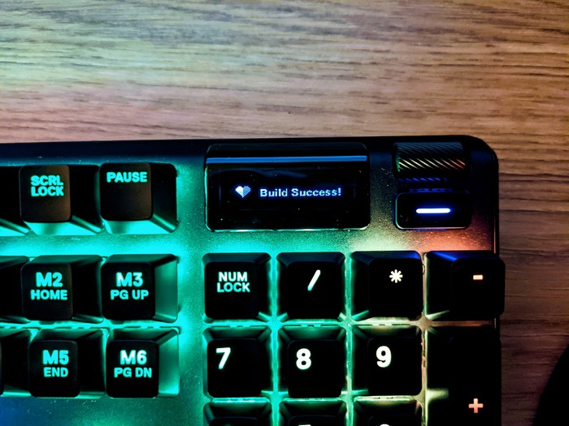
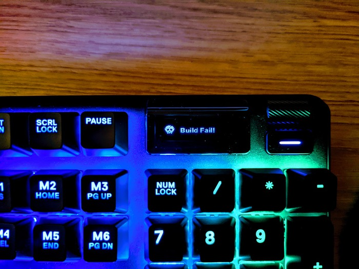
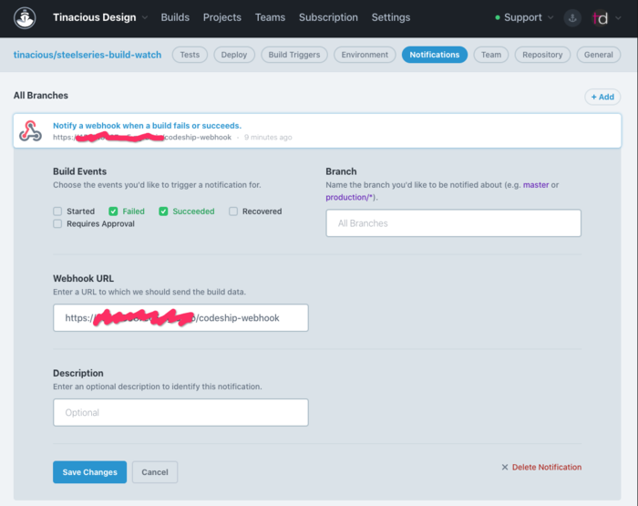

# Steelseries Build Watcher

This project allows you to configure your Steelseries keyboard to flash red or green depending on whether a continuous integration build succeeds or fails.

It integrates with the [Steelseries REST API](https://github.com/SteelSeries/gamesense-sdk) and [Codeship CI](https://app.codeship.com/).
- [Features](#features)
  - [Build Success](#build-success)
  - [Build Failure](#build-failure)
- [Usage](#usage)
  - [App Configuration](#app-configuration)
  - [Running the Server](#running-the-server)
  - [CI Configuration](#ci-configuration)
- [Contributing](#contributing)
  - [Additional CI Providers](#additional-ci-providers)
- [Further Reading](#further-reading)


## Features

When the build succeeds, the function row changes colour and the display changes based on the status.

### Build Success

When the build succeeds, the function row keys flash green 10 times and the display shows a success message. ❤️




### Build Failure

When the build fails, the function row keys flash red 10 times and the display shows a failure message. 💀




## Usage

### App Configuration

See the `.env.example` for configuration variables that are needed. They aren't all currently required.

Filling out these values will allow you to register your game with your keyboard.

- `GAME_NAME`: machine-friendly unique identifier for your game. Don't name it an actual game, make it unique to this app.
- `GAME_DISPLAY_NAME`: friendly display name (not used except for when registering)
- `GAME_DEVELOPER`: you (not used except for when registering)
- `GAMESENSE_ENDPOINT`: this is the endpoint your keyboard is listening on. You will need to follow the instructions in the [documentation for sending game events](https://github.com/SteelSeries/gamesense-sdk/blob/master/doc/api/sending-game-events.md) to retrieve the value from the `coreProps.json` file on your computer.


### Running the Server

You will need to run the server and send post requests to it. This step depends on the above **App Configuration** step.

Install the dependencies then run the server.

```
npm install
npm start
```

If you'd like to make modifications to the server, you can run `npm run dev` instead of `npm start` so that your build is being watched. This will cause your keyboard to flash sporadically any time there's a change.

Your server should be running on port 4000 and you should see a message similar to this with your own configuration values:

```
{
  APP_ENV: 'development',
  GAME_NAME: 'TINACIOUS_BUILD_WATCH',
  GAMESENSE_ENDPOINT: 'http://127.0.0.1:60667',
  GAME_DEVELOPER: '@tinaciousdesign',
  GAME_DISPLAY_NAME: 'Tinacious Build Watch',
  EVENT: { BUILD_SUCCESS: 'BUILD_SUCCESS', BUILD_FAIL: 'BUILD_FAIL' },
  FLASH_RATE: { frequency: 10, repeat_limit: 20 }
}
Health check: http://localhost:4000
Webhook: http://localhost:4000/codeship-webhook
Successfully registered BUILD_SUCCESS
Successfully registered BUILD_FAIL
```

You can make post requests from your terminal using cURL or via Postman using the Postman collection that's included in this repository.

Copy paste this to test success:

```sh
curl --location --request POST 'http://127.0.0.1:4000/codeship-webhook' \
--header 'Content-Type: application/json' \
--data-raw '{
    "build": {
        "status": "success"
    }
}'
```

Copy paste this to test failure:

```sh
curl --location --request POST 'http://127.0.0.1:4000/codeship-webhook' \
--header 'Content-Type: application/json' \
--data-raw '{
    "build": {
        "status": "error"
    }
}'
```

Once you've got it working locally, you're ready to move on to the next step: configuring Codeship continuous integration.

### CI Configuration

At this point, it's assumed that you are running the server locally and you are able to send success and failure events to see your keyboard react. If not, go back and make sure you are at that stage before continuing.

The app uses Codeship webhooks to report build status. You will need to set up a build on Codeship for the repository you'd like to watch. For now, you can fork this repository and point to it. If you do, your setup script should be `npm install` and you'll need to add a test script, `npm test`.

After setting up a project on Codeship, go to Project Settings → Notifications and create a new webhook configuration.

You'll need to run the server on your machine and expose the port so that Codeship can send you a web hook. You can use a service like [ngrok](https://ngrok.com/) to create a local tunnel.




## Contributing

### Additional CI Providers

It would be cool to have support for other CI providers. Ideally, CI configuration would not need to be done in the config file.

It would also be great to have the setting reset itself after a period of time. Currently, the function row colour and the display stay. Manually resetting the server resets your keyboard.


## Further Reading

- [How I made my keyboard flash red when the build breaks on CI 🚨](https://blog.tinaciousdesign.com/how-i-made-my-keyboard-flash-red-when-the-build-breaks-on-ci) - a blog post I wrote about this experiment
- [Steelseries Apex 7](https://steelseries.com/gaming-keyboards/apex-7?language=english&switch=blue) - This is the keyboard I got, with blue switches and English layout, but I believe many of their keyboards are supported though I cannot confirm which models exactly.
- [Steelseries GameSense SDK](https://github.com/SteelSeries/gamesense-sdk) - official documentation
- [Codeship CI](https://app.codeship.com/) - the continuous integration service I used which has a generous free plan
